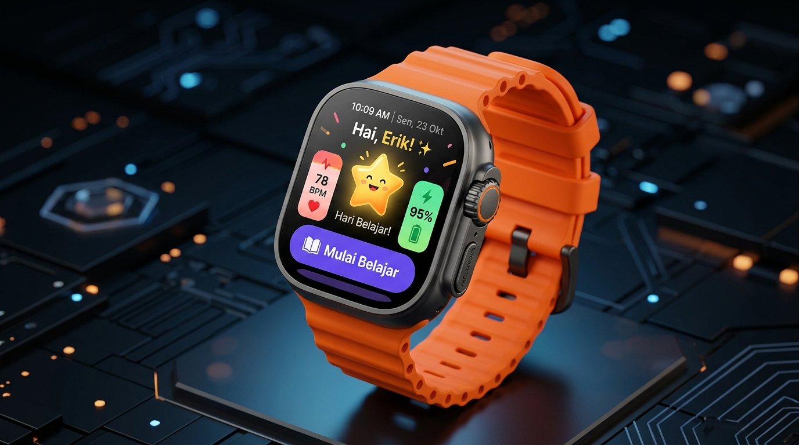

# ⌚ INCLUNOVA Smartwatch — Tiny Smart Learning Companion

<div align="center">


**Prototipe Interaktif Wearable Smartwatch Berbasis Web untuk Siswa Sekolah Inklusif**

*Dikembangkan dengan Next.js, dibungkus dalam frame fisik smartwatch interaktif lengkap dengan Digital Crown, simulasi Dual Battery, dan Multimodal Learning (TTS/STT).*

<br/>



</div>

---

## 📖 Tentang Proyek

**INCLUNOVA Smartwatch** dirancang bukan sekadar sebagai perangkat notifikasi, melainkan sebagai **antarmuka pembelajaran personal** bagi siswa sekolah dasar inklusif. Smartwatch ini menjadi teman belajar (*learning companion*) yang ramah, adaptif, dan mandiri baik di lingkungan sekolah maupun di rumah.

Prototipe ini diimplementasikan secara komprehensif mengacu pada 3 dokumen spesifikasi utama:
1. 📄 **`smartwatch_PRD.md`**: *Product Requirements Document* & metrik fungsionalitas.
2. 🏛️ **`smartwatch_arsitektur.md`**: Arsitektur sistem, energi ganda, sensorik, dan sinkronisasi data offline.
3. 🎨 **`smartwatch_desain.md`**: Pedoman desain UI/UX bertema *"Tiny Smart Learning Companion"*.

---

## 🌟 Fitur Utama

### 1. ⌚ Realistic Physical Smartwatch Hardware Frame
* **Chassis & Bezel Realistis:** Casing *squircle* melengkung modern berbahan ramah lingkungan dengan lapisan refleksi kaca layar (*glass sheen*).
* **Tali Jam Silikon (Strap):** Pilihan warna tali jam interaktif (*Solar Orange, Royal Indigo, Ocean Cyan, Berry Pink, Mint Green, Slate*).
* **Interactive Digital Crown:** Klik tombol crown fisik di sisi kanan untuk kembali seketika ke Layar Utama (*Home Screen*).
* **Tombol Samping Daya (Sleep/Wake):** Klik untuk mengaktifkan mode siaga hemat daya (*Always-on AMOLED sleep*) dan menyalakan kembali layar.
* **Getaran Haptic Fisik:** Simulasi getaran taktil nyata saat menjawab kuis dan notifikasi (menggunakan Web Vibration API `navigator.vibrate` + animasi gempa fisik casing jam).

### 2. 🌗 Dukungan Penuh Light & Dark Mode
* **Toggle Instan di Status Bar:** Beralih antara tema terang dan tema gelap hanya dengan 1 ketukan pada status bar jam tangan.
* **Tema AMOLED Dark:** Mengoptimalkan konsumsi daya baterai dengan latar belakang pekat (`#0B0F19`) dan kontras kartu tinggi yang ramah di mata anak.

### 3. 🔊 Multimodal Accessibility (TTS, STT, & Haptic)
* **Text-to-Speech (TTS) Bahasa Indonesia:** Membaca materi pembelajaran secara bersuara dengan intonasi ramah anak dan animasi gelombang audio (*waveform*).
* **Speech-to-Text (STT) Suara Siswa:** Siswa dapat menjawab pertanyaan kuis langsung melalui mikrofon jam tangan menggunakan *Web Speech Recognition*.
* **Umpan Balik Positif:** Microcopy ramah anak tanpa pesan galat yang menakutkan (*"Mantap! 🎉"*, *"Kamu Hebat!"*).

### 4. 📚 Modul Pembelajaran & Kuis Adaptif
* **Bite-Sized Flashcards:** Materi pecahan interaktif (1/2, 1/4, 2/4, 2/5) dengan visualisasi diagram batang dan potongan pizza.
* **Kuis Ceria & Gamifikasi:** Kuis pilihan ganda dengan target sentuh besar, reward perolehan XP (+10 XP), perayaan konfeti, dan lencana prestasi (*badges*).
* **AI Adaptive Learning ("✨ Untukmu"):** Rekomendasi materi yang disesuaikan secara otomatis berdasarkan kemampuan dan preferensi belajar siswa.

### 5. 🔋 Inovasi Sistem Energi Baterai Ganda (*Dual Battery*)
* **Slot Baterai Utama (Solar):** Baterai isi ulang bertenaga surya dari stasiun pengisian sekolah.
* **Slot Baterai Cadangan (Bio-Battery):** Teknologi baterai ramah lingkungan berbasis ekstrak limbah kulit buah.
* **Automatic Failover Switching:** Sistem otomatis beralih ke Bio-Battery cadangan saat baterai utama rendah (<20%), memastikan sesi belajar tidak terputus.

### 6. 🔄 Offline-First & Reliable Cloud Sync
* **Belajar Mandiri Offline:** Materi tetap dapat diakses di rumah tanpa internet; interaksi siswa dicatat ke antrean lokal (*event queue*).
* **Sinkronisasi Cerdas:** Sinkronisasi dua arah ke server sekolah saat kembali terhubung dengan pencegahan duplikasi data (*deduplication*).

### 7. 🩺 Pemantauan Kesehatan & Keamanan Siswa
* **Detak Jantung Real-time (BPM):** Grafik detak jantung (*ECG pulse animation*) untuk memantau kenyamanan fisik siswa.
* **School Safety Geofence:** Penanda status lokasi aman dalam perimeter sekolah inklusif.

---

## 🏛️ Arsitektur Sistem

```text
       ┌────────────────────────┐
       │     GURU / SEKOLAH     │
       └───────────┬────────────┘
                   │
                   ▼
       ┌────────────────────────┐
       │   INCLUNOVA PLATFORM   │
       │  (AI & Content Engine) │
       └───────────┬────────────┘
                   │ (Sync Downstream)
                   ▼
┌────────────────────────────────────────────────────────┐
│                  INCLUNOVA SMARTWATCH                  │
│                                                        │
│  ┌─────────────────┐  ┌──────────────────┐             │
│  │    UI LAYER     │  │ MULTIMODAL LAYER │             │
│  │ Home, Notif,    │  │ • TTS (Audio)    │             │
│  │ Learn, Quiz,    │  │ • STT (Voice)    │             │
│  │ Dark Mode       │  │ • Haptic Touch   │             │
│  └────────┬────────┘  └─────────┬────────┘             │
│           │                     │                      │
│           ▼                     ▼                      │
│  ┌───────────────────────────────────────┐             │
│  │            LEARNING ENGINE            │             │
│  │    Quiz Engine • Progress Tracker     │             │
│  └──────────────────┬────────────────────┘             │
│                     ▼                                  │
│  ┌───────────────────────────────────────┐             │
│  │       LOCAL CACHE & EVENT QUEUE       │             │
│  │    (Offline Learning Architecture)    │             │
│  └──────────────────┬────────────────────┘             │
│                     │                                  │
│  ┌──────────────────┴────────────────────┐             │
│  │           HARDWARE & SENSORS          │             │
│  │ • Dual Battery (Solar + Bio-Peel)     │             │
│  │ • Heart Rate (BPM) & Geofence Safety  │             │
│  └───────────────────────────────────────┘             │
└──────────────────────────┬─────────────────────────────┘
                           │ (Sync Upstream)
                           ▼
       ┌────────────────────────┐
       │      DATA PLATFORM     │
       │  AI Analytics & Rekom  │
       └────────────────────────┘
```

---

## 🚀 Panduan Memulai (*Quick Start*)

### Prasyarat
* [Node.js](https://nodejs.org/) versi 18.x atau lebih baru (Disarankan Node.js 20+)
* npm / pnpm / yarn

### Langkah Instalasi

1. **Clone repositori ini:**
   ```bash
   git clone https://github.com/username/SMARTWATCH-INCLUNOVA.git
   cd SMARTWATCH-INCLUNOVA
   ```

2. **Instal dependensi:**
   ```bash
   npm install
   ```

3. **Jalankan server pengembangan (*Development Server*):**
   ```bash
   npm run dev
   ```

4. **Buka di peramban Anda:**
   Akses `http://localhost:3000` (atau port yang tertera pada terminal).

---

## 📁 Struktur Direktori Proyek

```text
SMARTWATCH-INCLUNOVA/
├── app/
│   ├── globals.css              # Sistem desain CSS tokens, tema AMOLED, & animasi haptic
│   ├── layout.tsx               # Root layout & meta informasi Next.js
│   └── page.tsx                 # Halaman utama prototipe smartwatch terpusat
├── components/
│   ├── SmartwatchFrame.tsx      # Komponen chassis bezel fisik, crown, & tali jam
│   ├── SmartwatchOS.tsx         # Router internal & koordinator sistem operasi smartwatch
│   └── screens/
│       ├── HomeScreen.tsx       # Beranda utama, maskot Nova, & tombol Dark Mode
│       ├── LearnScreen.tsx      # Kartu belajar pecahan & narasi audio TTS
│       ├── QuizScreen.tsx       # Kuis pilihan ganda, konfeti, & perolehan skor XP
│       ├── STTScreen.tsx        # Antarmuka input jawaban suara mikrofon siswa
│       ├── AIRecommendScreen.tsx# Rekomendasi belajar adaptif berbasis profil
│       ├── NotificationsScreen.tsx # Notifikasi materi baru & pengumuman guru
│       ├── TeacherVoiceScreen.tsx # Pemutar pesan memo suara dari Bu Rina
│       ├── BatteryScreen.tsx    # Monitor baterai surya + bio-battery kulit buah
│       ├── OfflineSyncScreen.tsx# Status sinkronisasi offline & antrean rekaman
│       ├── HealthScreen.tsx     # Detak jantung siswa (BPM) & geofence sekolah
│       ├── ProgressScreen.tsx   # Grafik capaian mata pelajaran & lencana
│       └── SettingsScreen.tsx   # Pengaturan aksesibilitas & tampilan gelap
├── data/
│   └── smartwatchData.ts        # Data dummy materi, kuis, notifikasi, & pesan guru
├── types/
│   └── smartwatch.ts            # Definisi antarmuka TypeScript
├── utils/
│   └── audio.ts                 # Manager Web Audio API chimes & sintesis suara TTS
├── smartwatch_PRD.md            # Dokumen spesifikasi produk resmi
├── smartwatch_arsitektur.md     # Dokumen spesifikasi arsitektur teknis
├── smartwatch_desain.md         # Dokumen panduan desain UI/UX
├── package.json
└── tsconfig.json
```

---

## 🛠️ Teknologi yang Digunakan

* **Framework:** [Next.js 15](https://nextjs.org/) (App Router)
* **Library:** [React 19](https://react.dev/)
* **Bahasa:** [TypeScript 5](https://www.typescriptlang.org/)
* **Gaya & Desain:** Modern Vanilla CSS Design System (Glassmorphism, Micro-animations, AMOLED Dark Mode)
* **Efek & Perayaan:** `canvas-confetti`
* **Ikon:** `lucide-react`
* **Audio & Suara:** Web Audio API (Synthesized pleasant chimes) & Web Speech API (Indonesian TTS Speech Synthesis)

---

## 🤝 Kontribusi

Kontribusi, perbaikan, dan saran pengembangan selalu disambut baik!
1. Fork repositori ini
2. Buat branch fitur Anda (`git checkout -b feature/FiturKeren`)
3. Commit perubahan Anda (`git commit -m 'Menambahkan fitur keren'`)
4. Push ke branch Anda (`git push origin feature/FiturKeren`)
5. Ajukan sebuah *Pull Request*

---

## 📄 Lisensi

Didistribusikan di bawah Lisensi **MIT**. Lihat `LICENSE` untuk informasi lebih lanjut.

---

<div align="center">
  <sub>Dibuat dengan ❤️ untuk mendukung pendidikan inklusif anak Indonesia bersama <strong>INCLUNOVA</strong>.</sub>
</div>
